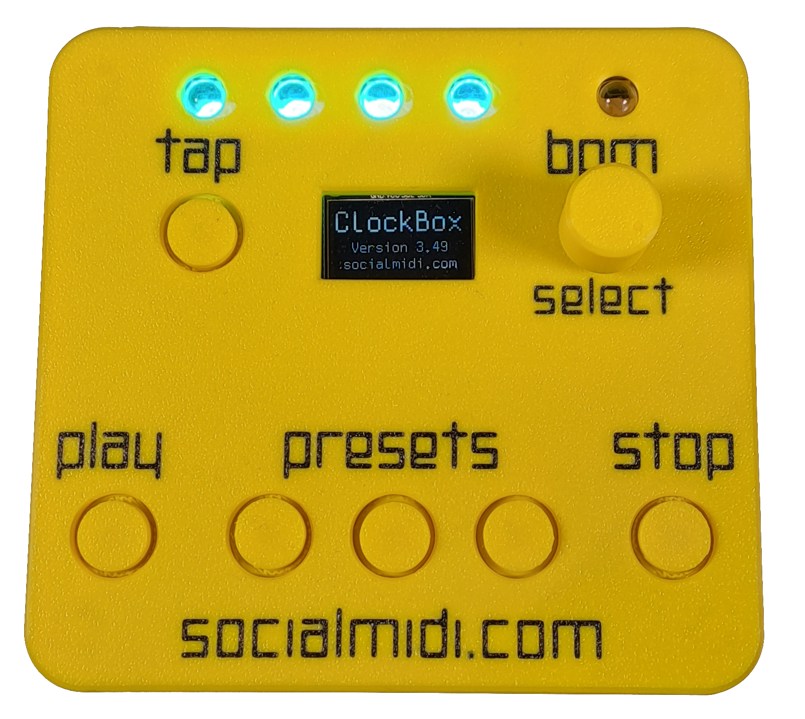
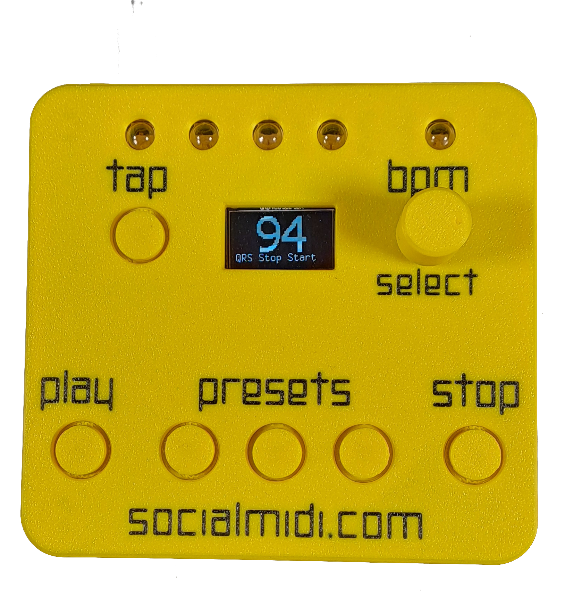
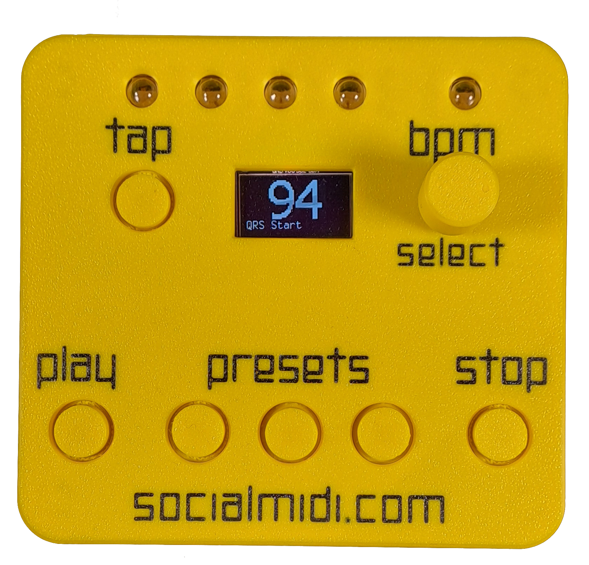
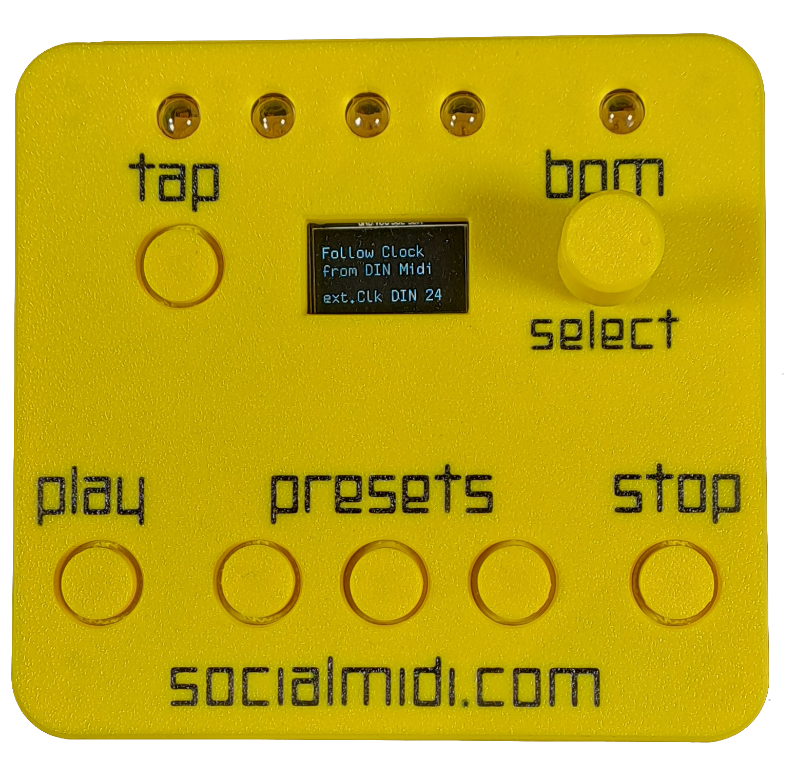
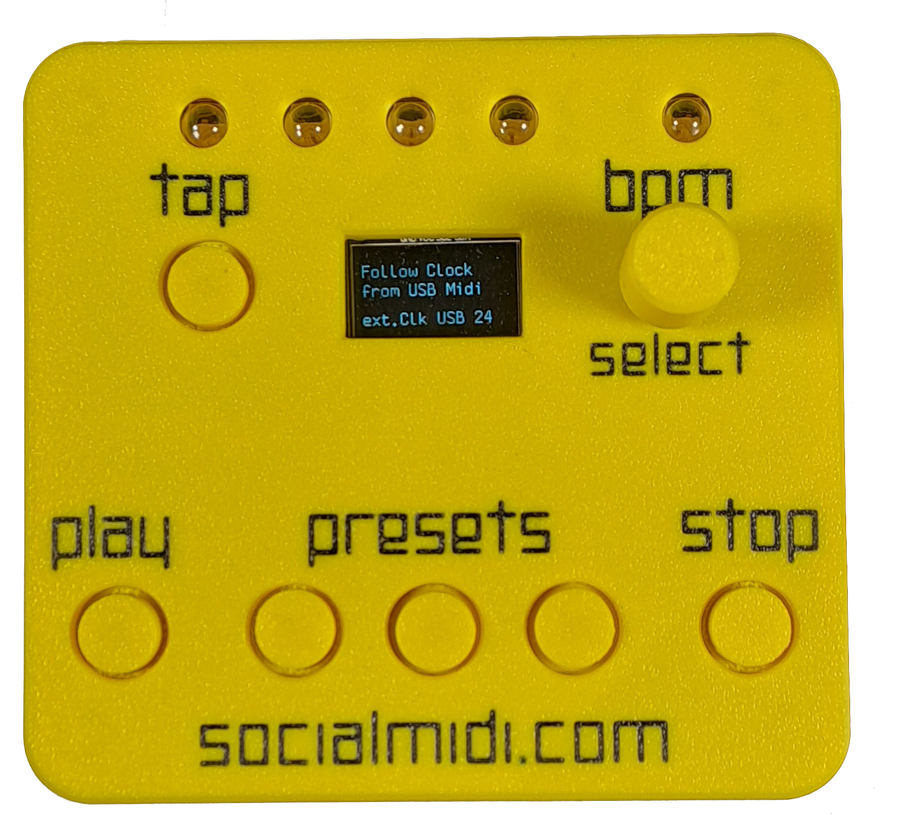

# ClockBox v3 – User Manual

---

## 1. Introduction

Welcome to the world of reliable MIDI clock synchronization.

If you are reading this manual, you have probably already experienced the challenges of synchronizing a DAW with drum machines, synthesizers, or other MIDI-enabled devices. MIDI clock synchronization can be tricky, and timing issues, jitter, or drifting devices are common problems.

We have encountered virtually every single one of these issues ourselves. That experience led us to develop the **ClockBox v3**—a dedicated hardware solution designed to make MIDI clock synchronization stable, predictable, and stress-free.

With the ClockBox v3, syncing is no longer a problem.

More information:  
https://socialmidi.com/RL

---

## 2. Features

- 6 MIDI outputs (TRS, Type A)
- 1 MIDI input (TRS, Type A)
- 1 MIDI input/output via USB
- CV/Gate output
- Tempo presets
- Quantized Restart (QRS)
- Open-source firmware
- Customizable hardware

---

## 3. Hardware Overview

### 3.1 Top View

Buttons, encoder, LEDs, and display are located on the top panel.

---

### 3.2 Front View

The front panel provides three connectors, from left to right:

1. CV Clock output  
2. CV Start output  
3. MIDI IN (TRS Type A)

---

### 3.3 Rear View

The rear panel hosts six TRS MIDI OUT connectors (Type A).

---

### 3.4 Bottom View

The bottom of the device contains additional information about the available inputs and outputs.

---

## 4. Basic Usage

The ClockBox v3 can be operated as a standalone device or connected to a computer. Power is supplied via USB.  
When the device is powered on, the currently installed firmware version is shown on the display for approximately two seconds.  

By default, the ClockBox v3 starts in **QRS Stop Start** mode at 94 BPM. In this configuration, it acts as a ready-to-use tempo master. Simply power on the device, connect your instruments, and press **PLAY**.

*(Diagram example: DAW MIDI configuration, e.g. Ableton Live)*

---

### 4.1 Setting the Tempo

The tempo can be set in three ways:

- Using the **TAP** button
- Turning the encoder
- Recalling a stored tempo preset

Turning the encoder changes the tempo in steps of ±1 BPM.  
Pressing and holding the encoder while turning it changes the tempo in steps of ±5 BPM.

Short-pressing a preset button immediately recalls the stored tempo.  
Pressing and holding a preset button for more than two seconds causes the ClockBox v3 to smoothly fade to the new tempo.

---

### 4.2 Saving a Tempo Preset

To save a tempo preset:

1. Press and hold the encoder  
2. Press one of the preset buttons  

The LEDs on the top panel will flash red, indicating that the tempo has been successfully saved.

---

### 4.3 QRS – Quantized Restart

**“Just hit PLAY while the clock is running.”**

Quantized Restart allows connected devices to be re-synchronized seamlessly without stopping the clock. When multiple devices are driven by a single clock source, individual devices may drift out of sync over time.

If you notice that one or more devices are no longer playing in sync, simply press **PLAY** while the clock is running. The LEDs will change color, and all connected devices will be re-synchronized on the next musical “1”.

---

## 5. Advanced Usage

### 5.1 Operating Modes

Starting with firmware version **3.49**, the ClockBox v3 offers four operating modes:

- QRS Stop Start  
- QRS Start  
- Follow Clock from DIN MIDI  
- Follow Clock from USB MIDI  

The currently selected mode is shown in the lower part of the display.

---

### 5.2 Changing the Mode

To change the operating mode:

1. Press and hold the encoder  
2. Press the **PLAY** button  

The display will show the newly selected mode. Repeat this procedure to cycle through all available modes.

The selected mode is automatically saved and restored the next time the device is powered on.

---

### 5.3 QRS Stop Start Mode

In this mode, the ClockBox v3 acts as a tempo master. This is the recommended default mode for most setups.
If one or more connected devices drift out of sync, press **PLAY** while the clock is running. This activates Quantized Restart.
The ClockBox v3 sends a **MIDI STOP** message, followed by a **MIDI START** message on the next “1”. This ensures that all connected devices are re-synchronized without manual timing adjustments.

*(Example diagram)*

---

#### 5.3.1 QRS Stop Start Fine-Tuning

The time interval between the MIDI STOP and MIDI START messages can be adjusted.

To adjust the QRS offset:

1. Press and hold the encoder  
2. Press the **STOP** button  

The display will show **“QRS Offset (PPQN)”**.  
Turning the encoder allows you to set a value between **1 and 24 PPQN**.  
Releasing the encoder stores the selected value.

At a value of 24, the ClockBox v3 sends the MIDI STOP message on the 4th beat and the MIDI START message on the next “1”.

The optimal value depends on the slowest device in your setup, but a value of **2 PPQN** has proven sufficient for most devices.

---

### 5.4 QRS Start Mode

In this mode, the ClockBox v3 acts as a tempo master. When Quantized Restart is triggered by pressing **PLAY** while the clock is running, only a **MIDI START** message is sent on the next “1”.

---

### 5.5 Follow Clock from DIN MIDI

In this mode, the ClockBox v3 acts as a tempo follower. Incoming MIDI clock data received via the MIDI IN connector is processed and forwarded to all six MIDI OUT ports as well as to USB.

---

### 5.6 Follow Clock from USB MIDI

In this mode, the ClockBox v3 follows incoming MIDI clock data received via USB.

*(Diagram: clock chain, QRS, 24 PPQN)*

---

## 6. CV / Gate Output

The CV and Gate outputs allow you to control analog synthesizers, Eurorack modules, and other CV-compatible equipment.

*(Diagram)*

---

### 6.1 Clock Multiplier

*(Button combinations and example)*

---

## 7. Resetting the Device

*(Description to be added)*

---

## 8. Firmware Update

Firmware updates may introduce new features, improvements, or bug fixes.

### 8.1 Update Mode

To update the firmware, the ClockBox v3 must be put into **Update Mode**.

1. Power off the device  
2. Press and hold the **PLAY** and **STOP** buttons  
3. Connect the device to your computer via USB  

The top four LEDs will light up red, and the display will indicate that the device is in Update Mode.

---

## 9. FCC Compliance

*(Information to be added)*

---

## 10. Version History

*(Information to be added)*
