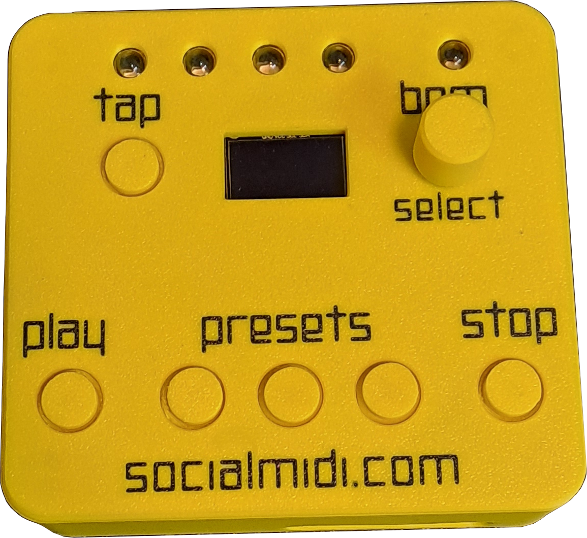
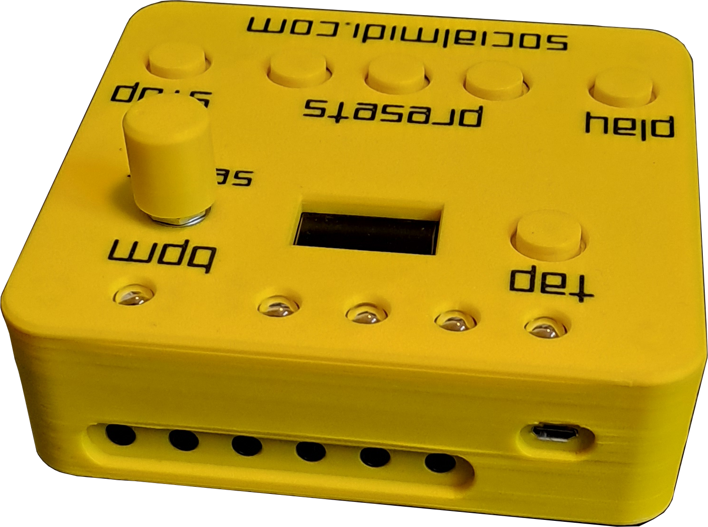
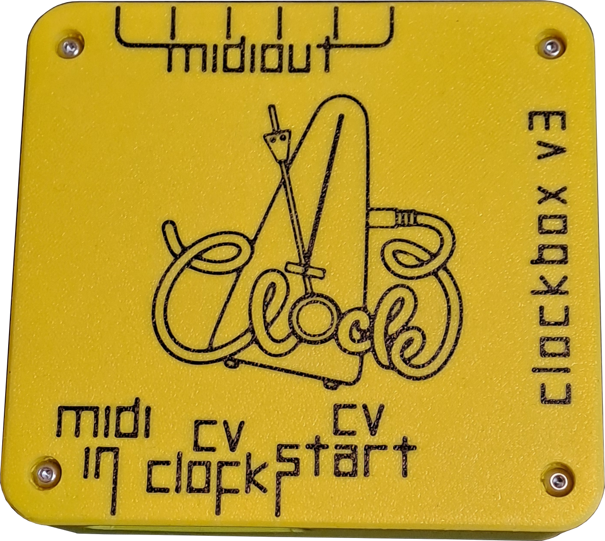

# ClockBox v3 Manual

## Intro
Welcome to the wonderful world of tempo-syncing devices via MIDI. If you came here you probably tried to sync your DAW with a drum computer, a synthesizer, or something else and realized that this topic DOES have its quirks.

[https://socialmidi.com](https://socialmidi.com/)

## Features
- 6 MIDI outputs (DIN)
- 1 MIDI input (DIN)
- 1 MIDI IN / OUT via USB
- CV/Gate sync output
- 3 tempo presets with smooth fade
- Quantized Restart (QRS)
- 4 clock modes (standalone / follower)
- Open source

---

## Hardware

### Top view

**Controls (top panel):**

| Label | Type | Function |
|---|---|---|
| TAP | Button | Tap tempo |
| PLAY (START) | Button | Start / Quantized Restart |
| STOP | Button | Stop |
| PRESET 1 / 2 / 3 | Button | Recall or save BPM presets |
| PRESET SWITCH 1 / 2 / 3 | Footswitch jack | Footswitch input for each preset |
| ENCODER | Rotary + click | Adjust BPM / navigate settings |
| Display | 128×64 OLED | Shows BPM and mode info |
| LEDs (×4) | NeoPixel | Beat and status indicators |

### Front view
CV/Gate, MIDI IN

### Rear view
6 MIDI OUT

### Back view

---

## Basic Usage

The ClockBox v3 can run standalone or connected to a computer. Apply power via USB and you are good to go. When powered on, the device shows the installed firmware version for 2 seconds.

By default the device is set to **QRS Stop Start** mode — the go-to mode for most setups. Connect your MIDI devices, power on the ClockBox, and press PLAY.

### Set the Tempo

- **TAP button** — tap repeatedly (4 taps) to set BPM by feel
- **Encoder (turn)** — adjust BPM ±1 per click
- **Encoder (hold + turn)** — adjust BPM ±5 per click
- **Preset buttons (short press)** — instantly jump to a saved BPM value
- **Preset buttons (long press, ≥1 second)** — smoothly fade to the saved BPM value

### Save a Tempo Preset

Hold the **encoder button** and click **PRESET 1**, **2**, or **3**. The LEDs flash red to confirm the new value has been saved.

Three preset slots are available. Each stores a single BPM value (integer). Factory defaults are 80, 100, and 120 BPM.

### QRS: Quantized Restart

**Just hit PLAY while the clock is running to re-sync everything.**

Over time, individual devices can drift out of sync even when connected to the same clock source. Quantized Restart (QRS) fixes this without stopping the music. When you press PLAY while the clock is running, the LEDs change colour to indicate QRS is armed. On the next beat 1, all connected devices receive a MIDI Stop and/or Start signal and automatically snap back to the correct position.

---

## LED Indicators

| Colour | Meaning |
|---|---|
| Cyan (all) | Power-on initialization |
| Green (LED 1) | Beat 1 of the current measure (playing) |
| Blue (LEDs 2–4) | Beats 2, 3, 4 of the measure (playing) |
| Purple / Magenta | Quantized Restart queued — waiting for next beat 1 |
| Red (all) | Saving to memory, or Firmware Update Mode |
| Off | Clock stopped |

---

## Display

| Display content | When shown |
|---|---|
| Large BPM number | Standalone modes (A or B) |
| "QRS Start" (bottom bar) | Standalone A mode |
| "QRS Stop Start" (bottom bar) | Standalone B mode |
| "Follow Clock from DIN Midi" | Follow DIN mode |
| "Follow Clock from USB Midi" | Follow USB mode |
| Beat blink indicator (top-right) | Every quarter note pulse |
| "QRS Offset (PPQN): N" | While editing QRS Offset |
| "Clock Divider: /N" | While editing Clock Divider |

---

## Advanced Usage

### Modes

The ClockBox v3 has four modes that determine how it generates or follows a clock signal. The active mode is shown at the bottom of the display and is saved automatically.

#### QRS Stop Start *(default)*
The ClockBox generates the master clock. When Quantized Restart is triggered (PLAY while running), it sends **MIDI Stop** slightly before the downbeat, then **MIDI Start** exactly on beat 1. This is the most compatible mode for hardware that needs a Stop message before it will reset.

#### QRS Start
The ClockBox generates the master clock. Quantized Restart only sends a **MIDI Start** on the next beat 1 — no Stop message. Use this if your devices handle a naked Start gracefully.

#### Follow Clock from DIN MIDI
The ClockBox receives a 24 PPQN MIDI clock signal on the **MIDI IN** (DIN) jack and forwards it to all outputs (6 DIN MIDI OUT + USB). BPM is not displayed in this mode to keep the clock pass-through as tight as possible. The internal clock generator is bypassed.

#### Follow Clock from USB MIDI
Same as above, but the clock source is **USB MIDI** instead of DIN. Incoming clock data are forwarded to the DIN MIDI outputs.

### Changing the Mode

**Hold ENCODER + press PLAY (START)** → cycles to the next mode:

> QRS Stop Start → QRS Start → Follow DIN → Follow USB → QRS Stop Start → ...

The new mode appears on the display and is saved immediately.

### QRS Offset Fine-Tuning

In QRS Stop Start mode, you can adjust the timing gap between the MIDI Stop and MIDI Start messages.

**Enter:** Hold **ENCODER + press STOP**
**Adjust:** Turn encoder (range: 1–24 PPQN ticks)
**Save & exit:** Release both buttons — LEDs flash red to confirm

- **Value 1**: Stop is sent very close to beat 1 (tightest)
- **Value 24**: Stop is sent on beat 4 of the previous bar (most lead time)
- **Recommended: 2** — tested sweet spot with Ableton and most hardware

The value is saved to internal memory and recalled at startup.

---

## CV/Gate Sync Output

The front-panel CV/Gate jack outputs a tempo pulse that can trigger Eurorack sequencers, drum machines, and other modular gear.

- Signal is only active **while the clock is playing**
- Pulse rate is determined by the **Clock Divider** setting

### Clock Divider

Divides the CV/Gate output rate relative to the master clock.

**Enter:** Hold **ENCODER + press TAP**
**Adjust:** Turn encoder
**Save & exit:** Release both buttons — LEDs flash red to confirm

Available divisions: **/1, /2, /4, /8, /16, /32, /64**
Default: /1 (one pulse per 24th note; i.e., the raw 24 PPQN rate)

---

## Reset the Device

**Reset clock mode to default (Standalone A):**
Power off, hold **STOP + TAP**, power on. The display shows "ClockMode reset" and the device boots in Standalone A mode.

---

## Firmware Update

### When to Update
Update the firmware to access new features or bug fixes published at socialmidi.com.

### Entering Update Mode

1. Power off the ClockBox.
2. Hold the **STOP** button.
3. Connect USB to your computer (power on).
4. The 4 top LEDs turn **red** and the display shows "UpdateMode".

The device is now ready to receive a new firmware upload from the Arduino IDE. MIDI output is silenced during this mode.

After uploading, power-cycle the device normally.

---

## MIDI Clock Behaviour

In Standalone modes, MIDI clock ticks (byte `0xF8`) are sent **continuously** — even when the transport is stopped. This helps devices like Ableton Live that adapt to incoming clock slowly. Transport messages (Start `0xFA`, Stop `0xFC`) are sent only when the transport state changes.

Clock is sent simultaneously on:
- All DIN MIDI outputs (hardware serial, 31250 baud)
- USB MIDI

In Follow modes, clock bytes are passed through immediately with no buffering to keep jitter as low as possible.

---

## Saved Settings (EEPROM)

All settings persist through power cycles.

| Setting | Default |
|---|---|
| Preset 1 BPM | 80 |
| Preset 2 BPM | 100 |
| Preset 3 BPM | 120 |
| Clock Mode | QRS Standalone A |
| QRS Offset | 1 |
| Clock Divider | /1 |

---

## FCC / Regulatory
*To be added.*

## Version
Firmware v3.50
